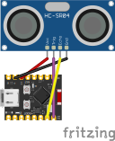

# HC-SR04
Measure distance (cm) using a HC-SR04 sensor.

## Wiring Diagram

### Note
- You can solder pins to the ESP32-C3 and place the ESP32-C3 on the breadboard, similar to how a Raspberry Pi Pico is usually used.

### Materials Needed
- HC-SR04
- Jumper wires

## Resources
- https://medium.com/@zacchaeusoluwole/build-a-real-time-web-based-distance-monitoring-system-with-rust-on-esp32-6934b4eed6f2

## TODO
- Someone with an actually working HC-SR04 sensor may have to tweak the code. My sensor stops working properly at distances >60cm
