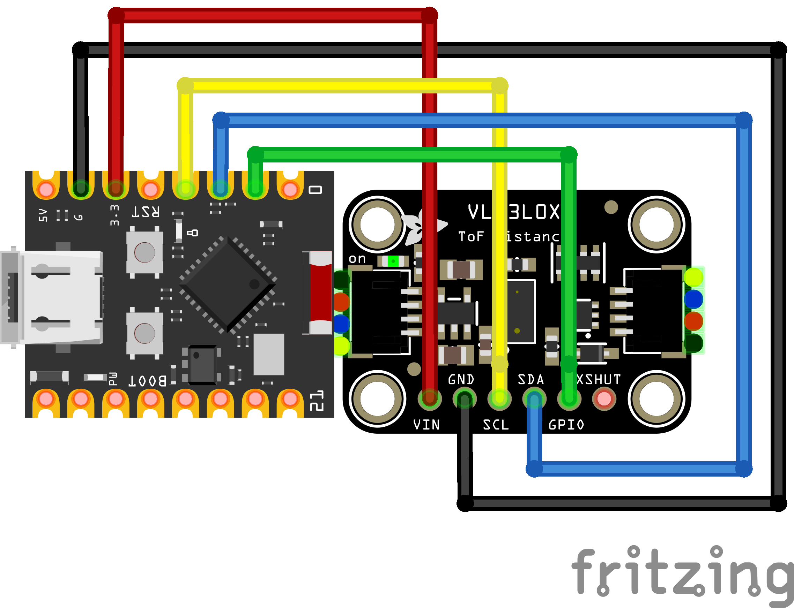

# VL53L0X
Measure distance (mm) using a VL53L0X sensor.

## Wiring Diagram

### Note
- You can solder pins to the ESP32-C3 and place the ESP32-C3 on the breadboard, similar to how a Raspberry Pi Pico is usually used.
- Your VL53L0X sensor can look different. Mine is purple, and much smaller than my ESP32-C3.

### Materials Needed
- VL53L0X - I bought [this one](https://www.aliexpress.us/item/3256805991515041.html), note: It can only sense up to 1.2m 
- Jumper wires

## Resources
- VL53L0X Documentation: https://www.st.com/resource/en/datasheet/vl53l0x.pdf
- VL53L0X Rust Library: https://github.com/copterust/vl53l0x
- I2C Tutorial: https://dev.to/apollolabsbin/esp32-standard-library-embedded-rust-i2c-communication-53c3
