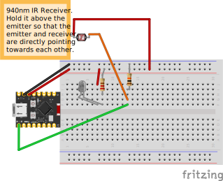

# Analog
Get an analog input of how much IR light the receiver is sensing.

## Wiring Diagram

### Note
- The actual IR receiver will look like a black LED, not like a circle / square photo-resistor.
- You can solder pins to the ESP32-C3 and place the ESP32-C3 on the breadboard, similar to how a Raspberry Pi Pico is usually used.

## Tips
- Use two long jumper wires so that you can move around the receiver. You can try to adjust the position and angle so that the light from the emitter goes directly to the receiver. As you move the receiver closer to the emitter, the measured voltage will increase.
