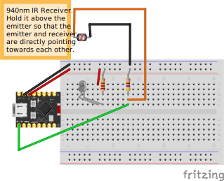

# Digital
Get a boolean input of whether the receiver is receiving an IR light or not.

## Wiring Diagram

### Note
- The actual IR receiver will look like a black LED, not like a circle / square photo-resistor.
- You can solder pins to the ESP32-C3 and place the ESP32-C3 on the breadboard, similar to how a Raspberry Pi Pico is usually used.

## Tips
- The resistor that is part of the receiving circuit can be changed to adjust the "sensitivity" of the input. Using smaller resistor values will let you activate the input when the receiver is farther away from the emitter. Using larger resistor values will only activate the input when the receiver is closer to the emitter.
- Use two long jumper wires so that you can move around the receiver. You can try to adjust the position and angle so that the light from the emitter goes directly to the receiver. Try moving the receiver away and towards the emitter and see at what distance the input activates.

## TODO
Use async / interrupts instead of a busy loop to reduce power usage. If you figure out how to do this please make a PR. 