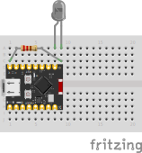

# IR Remote
Use your computer as a universal remote by connecting a ESP32 with an IR emitter to your computer.

## Materials needed
- 940nm IR Emitter (I used [this one](https://www.aliexpress.us/item/3256804917721113.html) (the 3mm version))

## Wiring Diagram

