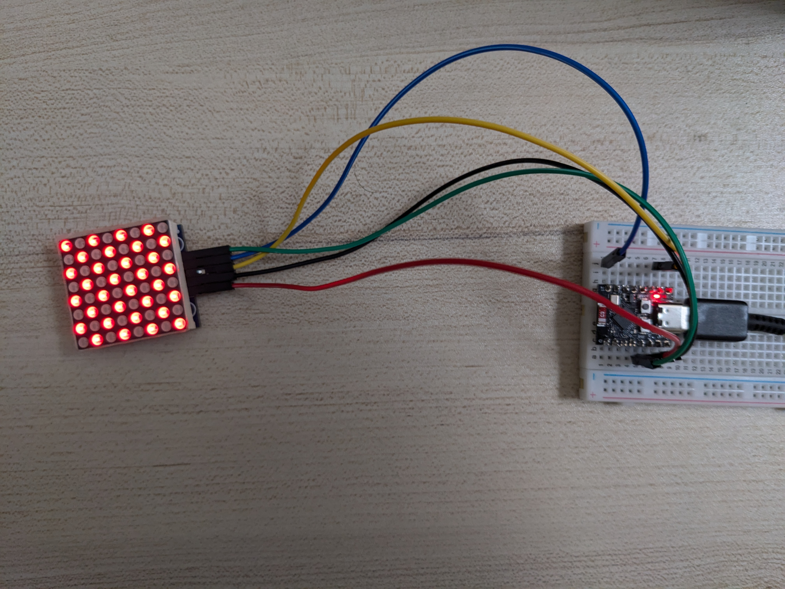

# max7219

Use a 8x8 LED matrix with a ESP32-C3 Super-Mini.

# Resources
- [Rust esp32 SPI](https://github.com/shanemmattner/ESP32-C3_Rust_Tutorials/tree/abe228df29f93bb43d22aee3868eb8bb2b03574a/Tutorials/p6-spi)
- [max7219 crate](https://crates.io/crates/max7219)

# Materials
- I got it from https://www.pcbway.com/project/gifts_detail/MAX7219_8x8_RED_LED_Dot_Matrix_Module.html
