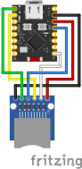

# SPI MicroSD Card Module
A MicroSD card module lets you insert a MicroSD card into it, and exposes the MicroSD card through SPI. In this example, a single file is read. The library this example uses also lets you do many other file system operations, such as writing to files.  

## Wiring Diagram

## Resources
- https://crates.io/crates/embedded-sdmmc
- [shanemmattner/ESP32-C3_Rust_Tutorials](https://github.com/shanemmattner/ESP32-C3_Rust_Tutorials/tree/main/Tutorials/p6-spi)

## TODO
There can be random crashes and restarts. Errors should be better handled and retried.
