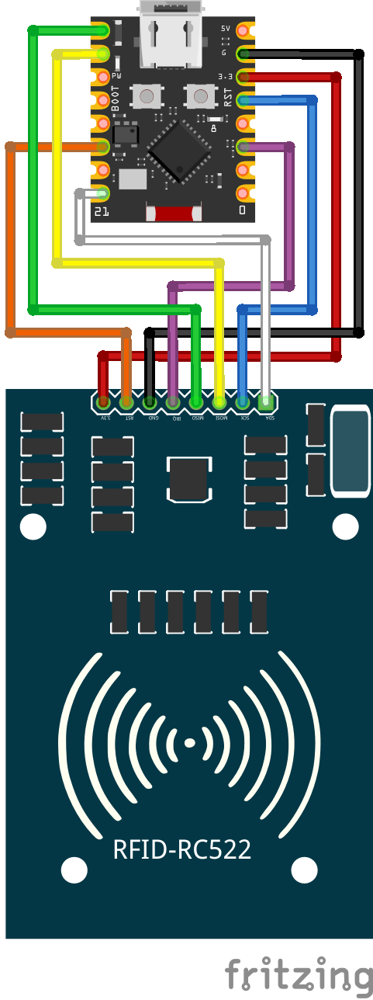

# RC522 NFC Reader
Get the UID of 13.56 MHz NFC tags.

## Wiring Diagram

We wire the IRQ pin, but currently the library we use in this example doesn't support receiving interrupts from the RC522, so this wire isn't actually used in this example.

## rx gain values and distance
From my testing. The distances are not at what distance it's *reliable*. It's what distance does the card's id occasionally get read by the reader. So it's more of an upper bound to avoid making the reader too sensitive. 

| RxGain | Distance (cm) |
| ------ | ------------- |
| DB18   | 1.4           |
| DB23   | 2.9           |
| DB33   | 4.6           |
| DB38   | 5.7           |
| DB43   | 5.9           |
| DB48   | 6.9           |

## Resources
- https://microcontrollerslab.com/rc522-rfid-reader-pinout-arduino-interfacing-examples-features/
- [Fritzing for RC522](https://github.com/miguelbalboa/rfid/blob/046072a9f7ad7bbe0518a809a755a7a1cc97e15f/doc/fritzing/RFID-RC522-v3.fzpz)

## TODO
- Make the library work with async API and the interrupt pin

## Reading and writing data
This example only gets the UID of the NFC tag. But the RC522 can also be used to read and write data. Feel free to add an example that reads or writes data to this repo!
