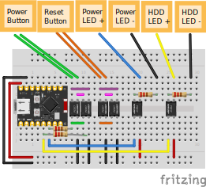

# Smart Power Button for Desktop Computers
## Why
- I got a gaming computer that I will also remotely use for programming
    - I want to play Overwatch
    - I want to do CPU heavy coding stuff like compiling the Linux kernel from source and working on large Rust projects
    - My Xbox (Xbox One S) can't run Overwatch well
    - My laptop (jinlon (HP Elite c1030 Chromebook)), can't compile code fast
- I want to remotely wake up my computer for programming
    - My gaming computer is connected to the living room TV. It does not have a good spot for programming.
- My computer can't Wake on LAN

## Features
- Remotely press the power and reset buttons of your computer, even when it's shut down or in suspend mode.
- Remotely view the status of the power LED and HDD LED, so you know if it's on / in suspend mode / off.
- Isolated circuits. The ESP32 does not need to have the same power source as the computer. For example, you can power it through USB-C that's connected to a laptop running on battery.
- Turn on the computer automatically when a Bluetooth game controller or other Bluetooth device is on and within range.

## Code setup
Copy `esp/example.env` to `esp/.env`. Edit the file to include your Wi-Fi info and GPIO pin numbers.

## Developing
### Making changes to the web page without flashing web page to ESP
Flashing all the web assets to the ESP takes a long time and wears down the flash more. Instead, do the following:
- In the `esp`, run `cargo r --no-default-features --features std,embassy,esp-idf-svc/native`. This will run without the `static-files` feature, which means that the files built by Trunk will not be included in the ESP code.
- View the output from the ESP to get the IP address of the ESP
- Copy `web/example.env` to `web/.env`. Edit the `WS_HOST` variable to be the ip address of the ESP
- Run `trunk serve` in `web`
- Open the web page served by Trunk in your browser instead of the ESP's server

### Running ESP in release mode to reduce size
Running the `esp` code in with `--release` reduces size, which saves time.

## Flashing Code for Normal Use
- Configure the `.env` files. See [#developing](#developing).
- Run `trunk serve --release` in `web`
- Run `cargo r --release` in `esp`

## Wiring Diagram

## Pictures

In my setup, I used an ATX power splitter so that I could access the 5VSB and GND pins to always power the ESP32-C3, even when the computer is off.

## Materials Needed
(In addition to a ESP32-C3)
- 6x PC817 (or other optocoupler). I bought [this one](https://www.aliexpress.us/item/3256806236608107.html)
- ATX Splitter (optional, for always powering the ESP32-C3 with the PSU). I bought [this one](https://www.aliexpress.us/item/3256805387697490.html?spm=a2g0o.order_list.order_list_main.38.36df1802MgpdVl&gatewayAdapt=glo2usa)
- Breadboard and wires or some way of connecting the components together
